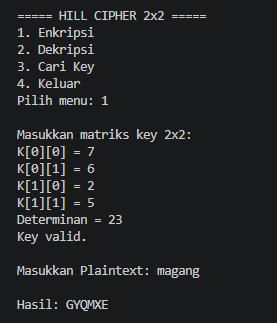
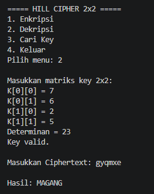
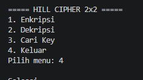

# ALGORITMA HILL CIPHER

## Cara kerja program
### 1. Persiapan teks
* Program mengambil teks input, menghilangkan spasi atau simbol, dan mengubah semua huruf jadi kapital
* Huruf diubah jadi angka ($A=0, B=1, \dots, Z=25$)
* Kalau jumlah hurufnya ganjil ketika mau dienkripsi, otomatis ditambah huruf **X** di paling belakang supaya bisa dipecah jadi pasangan 2 huruf

### 2. Eknripsi & Dekripsi
* Kunci matriks diuji dulu.
* Enkripsi: Pasangan huruf dikali dengan matriks kunci, lalu dimodulo 26 untuk mendapatkan ciphertext
* Dekripsi: menggunakan invers dari matriks kunci untuk mengembalikan *ciphertext* ke plain text

### 3. Pencarian Kunci
1. cara matriks: program cari 2 pasang huruf yang matriksnya punya invers, lalu hitung kuncinya pakai rumus $K = C \times P^{-1}$.
2. cara otomatis: Kalau kata yang diinput punya pola unik yang matriksnya bernilai 0 atau genap, program otomatis mencoba kombinasi kunci valid modulo 26 sampai ketemu kunci yang pas

### Hasil Running Program

#### 1. Enkripsi

#### 2. Dekripsi

#### 3. Mencari Kunci

#### 4. Keluar Program
