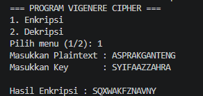
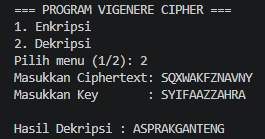

# Vigenere Cipher Program

## Cara Kerja / Alur Program

1. **Pilih Menu**: Program dijalankan, lalu pilih menu enkripsi / dekripsi
2. **Input Teks & Kunci**: Masukin teks (bisa plaintext atau ciphertext) dan key-nya. 
3. **Pengecekan Karakter**: Program memeriksa satu-satu karakter pake `isalpha()`. Kalau itu huruf alfabet, lanjut diproses.
4. **Konversi ke Angka & Perpanjangan Kunci**:
   * Huruf diubah jadi angka dari `0` sampai `25` (A=0, B=1, dst.) 
   * Kuncinya diulang otomatis pakai rumus modulus (`keyIndex % keyLength`) biar panjangnya cocok dengan teks.
5. **Rumus Perhitungan**:
   * **Enkripsi**: $E(x) = (x + K) \pmod{26}$
   * **Dekripsi**: $D(x) = (x - K + 26) \pmod{26}$
   * Ditambah 26 saat dekripsi untuk menghindari angka negatif
6. **Hasil Akhir**: Teks yang udah selesai diproses akan langsung ditampilkan ke layar.

### Hasil Running Program

#### 1. Enkripsi

#### 2. Dekripsi
